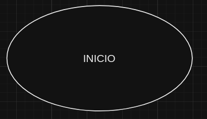
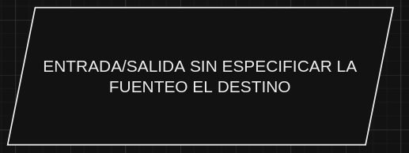
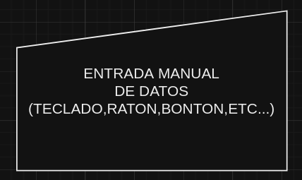
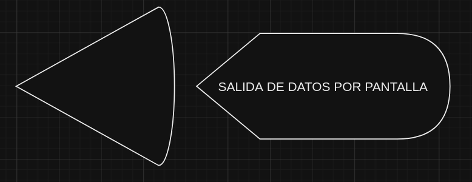
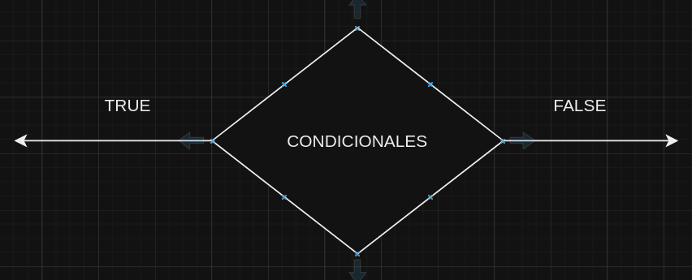
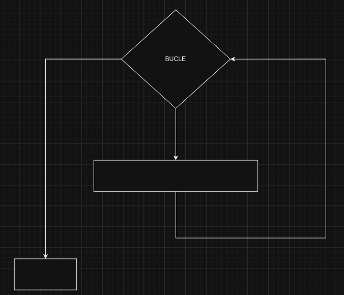
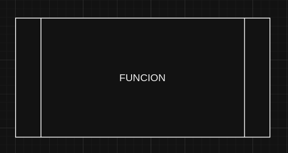
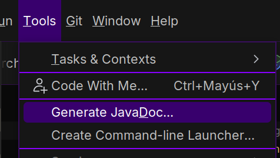
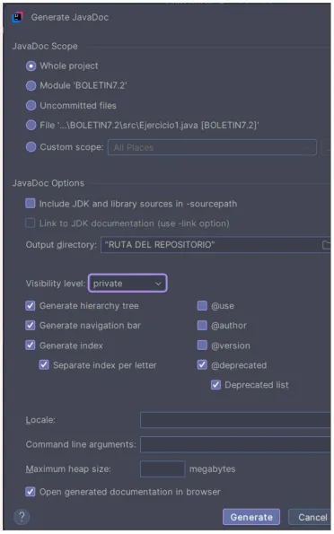

# 🌟 Diagramas de Flujo - COD 🌟

## 🖼️ Figuras del Diagrama

### 🔵 **Inicio/Fin**
> Representa el inicio o fin del diagrama.



### 🟢 **Procesos**
> Indica un paso o actividad dentro del proceso.


### 🟡 **Entrada/Salida**
> Representa entradas y salidas de datos generales sin especificar su fuente o destino.



### 🔴 **Entrada Manual de Datos**
> Se utiliza para datos ingresados manualmente.



### 🖥️ **Salida de Datos por Pantalla**
> Indica la presentación de resultados en un monitor.



### ⚖️ **Condicionales**
> Simboliza decisiones dentro del flujo, como "sí" o "no".



### 🔄 **Todo Tipo de Bucles**
> Incluye bucles como `while`, `do-while` o estructuras similares.



### 🔂 **Solo Bucles For**
> Representa bucles que tienen una estructura `for` específica.


### 🧩 **Funciones**
> Indica un subproceso o función reutilizable dentro del flujo.



# 🌟 **Comandos Básicos de Git** 🌟

---

## 🛠️ **Configuración Inicial**

- **Configura tu nombre y correo para los commits**:  
  `git config --global user.name "Tu Nombre"`  
  `git config --global user.email "tuemail@example.com"`

- **Verifica configuraciones actuales**:  
  `git config --list`

---

## 📂 **Repositorios**

- **Inicializa un nuevo repositorio en el directorio actual**:  
  `git init`

- **Clona un repositorio existente desde una URL**:  
  `git clone <URL-del-repo>`

---

## 🔄 **Control de Cambios**

- **Ver el estado del repositorio (archivos modificados, nuevos, etc.)**:  
  `git status`

- **Agregar archivos al área de preparación (staging)**:
    - Agregar un archivo específico: `git add <archivo>`
    - Agregar todos los cambios: `git add .`

- **Confirmar los cambios con un mensaje descriptivo**:  
  `git commit -m "Mensaje del commit"`

- **Mostrar las diferencias entre tu trabajo actual y el último commit**:  
  `git diff`

---

## 📜 **Historial**

- **Ver el historial completo de commits**:  
  `git log`

- **Mostrar los cambios realizados en un commit específico**:  
  `git show <hash-del-commit>`

---

## 🌳 **Ramas**

- **Listar todas las ramas en el repositorio**:  
  `git branch`

- **Crear una nueva rama**:  
  `git branch <nombre-rama>`

- **Cambiar a una rama específica**:
    - Método clásico: `git checkout <nombre-rama>`
    - Alternativa moderna: `git switch <nombre-rama>`

- **Eliminar una rama**:  
  `git branch -d <nombre-rama>`

---

## ⚡ **Fusión y Resolución de Conflictos**

- **Fusionar otra rama con la rama actual**:  
  `git merge <nombre-rama>`

- **Guardar temporalmente los cambios no confirmados**:  
  `git stash`

---

## 🌐 **Repositorios Remotos**

- **Listar repositorios remotos configurados**:  
  `git remote -v`

- **Agregar un nuevo repositorio remoto**:  
  `git remote add origin <URL-del-repo>`

- **Enviar commits al repositorio remoto**:  
  `git push origin <rama>`

- **Descargar e integrar cambios del repositorio remoto**:  
  `git pull`

- **Descargar actualizaciones del repositorio remoto sin integrarlas**:  
  `git fetch`

---

## ❌ **Eliminación y Reversión**

- **Eliminar un archivo del repositorio y del sistema**:  
  `git rm <archivo>`

- **Deshacer cambios en el área de preparación o en commits**:  
  `git reset <archivo>`

- **Revertir un commit anterior creando un nuevo commit de reversión**:  
  `git revert <hash-del-commit>`

---


# 🌟 **Guía de Comentarios JavaDocs** 🌟

## 📝 **¿Qué es JavaDoc?**
JavaDoc es una herramienta utilizada para generar documentación en formato HTML a partir de comentarios especiales en el código fuente de Java. Estos comentarios se escriben usando la sintaxis `/** ... */`.

## 🛠️ **Cómo Escribir Comentarios JavaDoc**
- **Estructura básica de un comentario JavaDoc**:  
  ```java
  /**
   * Una breve descripción del propósito de la clase, método o atributo.
   *
   * Detalles adicionales (opcional) sobre cómo funciona.
   * @etiqueta Descripción de la etiqueta
   */
  ```
## 📚 **Ejemplos de Uso**
- **Documentar una Clase**:
  ```java
  /**
   * Esta clase representa un Círculo en un sistema gráfico.
   * Permite calcular su área y circunferencia.
   */
  public class Circulo {
      // Código de la clase
  }
  ```
- **Documentar un Método**:
  ```java
  /**
   * Calcula el área de un círculo.
   *
   * @param radio El radio del círculo (en unidades).
   * @return El área del círculo (en unidades cuadradas).
   */
  public double calcularArea(double radio) {
      return Math.PI * radio * radio;
  }
  ```
- **Documentar un Atributo**:
  ```java
  /**
   * El radio del círculo en unidades.
   */
  private double radio;
  ```
- **Documentar un Constructor**:
  ```java
  /**
   * Constructor de la clase Circulo.
   *
   * @param radio El radio inicial del círculo.
   */
  public Circulo(double radio) {
      this.radio = radio;
  }
  ```

## 🧩 **Etiquetas Comunes en JavaDocs**
- **@param**: Describe un parámetro de un método o constructor.
  ```java
  /**
   * @param nombre El nombre del usuario.
   */
  public void setNombre(String nombre) { }
  ```
- **@return**: Describe el valor de retorno de un método.
  ```java
  /**
   * @return El área del círculo.
   */
  public double getArea() { 
      return radio * radio * Math.PI;
  }
  ```
- **@throws**: Describe excepciones que un método puede lanzar.
  ```java
  /**
   * @throws IllegalArgumentException Si el radio es negativo.
   */
  public void setRadio(double radio) {
      if (radio < 0) {
          throw new IllegalArgumentException("El radio no puede ser negativo");
      }
      this.radio = radio;
  }
  ```
- **@deprecated**: Indica que un método o clase ya no debería usarse.
  ```java
  /**
   * @deprecated Usar setNuevoRadio(double) en su lugar.
   */
  public void setRadioDeprecado(double radio) {
      this.radio = radio;
  }
  ```
- **@see**: Agrega una referencia a una clase, método o página relacionada.
  ```java
  /**
   * @see Math#PI
   */
  public void ejemplo() {
      System.out.println("Referencia a Math.PI");
  }
  ```
## 📂 **Generar javadocs desde inteliji**


