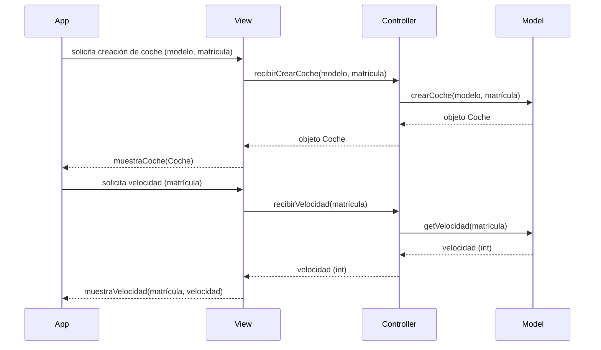

```mermaid
sequenceDiagram
%%  PARTICIPANTES
    participant App
    participant View
    participant Controller
    participant Model

%% 1️⃣  CREAR COCHE
    App ->> View: solicita creación de coche (modelo, matrícula)
    View ->> Controller: recibirCrearCoche(modelo, matrícula)
    Controller ->> Model: crearCoche(modelo, matrícula)
    Model -->> Controller: objeto Coche
    Controller -->> View: objeto Coche
    View -->> App: muestraCoche(Coche)

%% 2️⃣  CONSULTAR VELOCIDAD
    App ->> View: solicita velocidad (matrícula)
    View ->> Controller: recibirVelocidad(matrícula)
    Controller ->> Model: getVelocidad(matrícula)
    Model -->> Controller: velocidad (int)
    Controller -->> View: velocidad (int)
    View -->> App: muestraVelocidad(matrícula, velocidad)

    
```