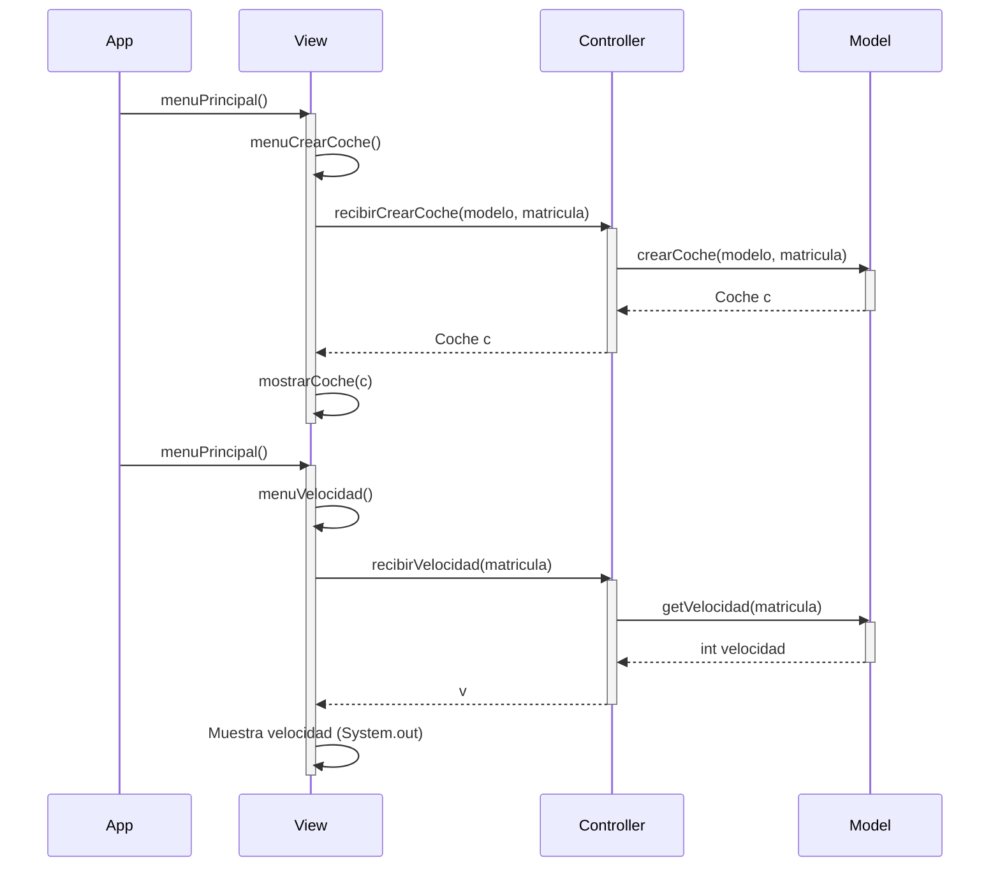

**No me dio tiempo de hacer los setters y getters de los atributos de la clase Coche.**
**En las nuevas funcionalidades no tuve en cuenta la velocidad del coche, pero sería lo mas lógico.**

```mermaid
sequenceDiagram
    participant App
    participant View
    participant Controller
    participant Model

%% Flujo para crear coche
    App->>View: menuPrincipal()
    activate View
    View->>View: menuCrearCoche()
    View->>Controller: recibirCrearCoche(modelo, matricula)
    activate Controller
    Controller->>Model: crearCoche(modelo, matricula)
    activate Model
    Model-->>Controller: Coche c
    deactivate Model
    Controller-->>View: Coche c
    deactivate Controller
    View->>View: mostrarCoche(c)
    deactivate View

%% Flujo para obtener velocidad
    App->>View: menuPrincipal()
    activate View
    View->>View: menuVelocidad()
    View->>Controller: recibirVelocidad(matricula)
    activate Controller
    Controller->>Model: getVelocidad(matricula)
    activate Model
    Model-->>Controller: int velocidad
    deactivate Model
    Controller-->>View: v
    deactivate Controller
    View->>View: Muestra velocidad (System.out)
    deactivate View
    
```